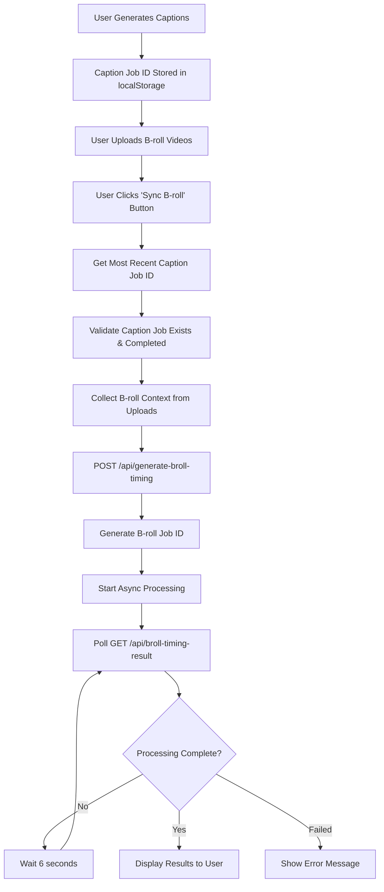

# Sync B-roll Workflow Documentation

## Overview

The Sync B-roll feature provides intelligent timing suggestions for B-roll footage based on generated captions. This workflow operates independently from caption generation, allowing users to generate B-roll timing after captions are complete.

## User Workflow

### Prerequisites
1. **A-roll video uploaded** - Main video content in the A-roll section
2. **Captions generated** - Must have completed caption generation with a valid job ID
3. **B-roll videos uploaded** - Secondary footage uploaded to the B-roll section

### Step-by-Step Process
1. **Generate Captions**: User generates captions for their A-roll video
2. **Upload B-roll**: User uploads B-roll videos to the uploads panel
3. **Sync B-roll**: User clicks the "Sync B-roll" button in the B-roll section
4. **Processing**: System generates timing suggestions asynchronously
5. **Results**: User receives notification when B-roll timing suggestions are ready

## Technical Implementation

### API Endpoints

#### 1. Generate B-roll Timing
```http
POST /api/generate-broll-timing
Content-Type: application/json

{
  "jobId": "string (required)",     // Caption generation job ID
  "videoId": "string (optional)",   // Video identifier
  "brollContext": [                 // Array of B-roll clip objects (required)
    {
      "id": "string",
      "name": "string",
      "url": "string",
      "metadata": { ... }
    }
  ]
}
```

**Response:**
```json
{
  "success": true,
  "brollJobId": "unique-job-id",
  "message": "B-roll timing generation started",
  "status": "processing"
}
```

#### 2. Get B-roll Timing Results
```http
GET /api/broll-timing-result/{brollJobId}
```

**Response (Processing):**
```json
{
  "brollJobId": "job-id",
  "status": "processing",
  "message": "B-roll timing suggestions are still being generated"
}
```

**Response (Completed):**
```json
{
  "brollJobId": "job-id",
  "status": "completed",
  "message": "B-roll timing suggestions generated successfully",
  "count": 5,
  "brollTimings": [
    {
      "id": "timing-id",
      "startTime": 0,
      "endTime": 5,
      "duration": 5,
      "brollClip": {
        "id": "broll-clip-id",
        "name": "B-roll 1",
        "url": "video-url",
        "thumbnail": "thumbnail-url"
      },
      "confidence": 0.85,
      "reasoning": "Suggested B-roll for segment 1 (0s - 5s)",
      "captionContext": "Hello everyone welcome to this video"
    }
  ]
}
```

**Response (Failed):**
```json
{
  "brollJobId": "job-id",
  "status": "failed",
  "error": "Error message",
  "message": "B-roll timing generation failed"
}
```

### Data Flow



### Code Structure

#### Frontend Components

**Upload Panel (`uploads.tsx`)**
- **Sync B-roll Button**: Appears when B-roll videos are uploaded
- **State Management**: Tracks syncing status and job ID
- **API Integration**: Calls B-roll timing endpoints
- **User Feedback**: Toast notifications for status updates

**Caption Context Utility (`load-available-captions-context.ts`)**
- `getMostRecentCaptionJobId()`: Retrieves latest caption job ID from localStorage
- Handles localStorage parsing and fallback logic

#### Backend Services

**Job Manager (`job-manager.ts`)**
- Extended `JobStatus` interface with `brollTimings` field
- Manages both caption and B-roll timing jobs
- Provides job lifecycle management (create, update, get, delete)

**B-roll Timing API (`generate-broll-timing/route.ts`)**
- Validates caption job completion
- Creates new B-roll timing job
- Processes timing generation asynchronously
- Returns job ID for result polling

**B-roll Results API (`broll-timing-result/[brollJobId]/route.ts`)**
- Retrieves job status and results
- Handles processing, completed, and failed states
- Provides detailed timing suggestions

### Mock B-roll Timing Algorithm

The current implementation uses a mock algorithm that:

1. **Segments Video**: Divides video into 5-second segments
2. **Maps B-roll**: Assigns available B-roll clips to segments
3. **Provides Context**: Includes relevant caption text for each segment
4. **Confidence Scoring**: Generates confidence scores (0.7-1.0)
5. **Reasoning**: Provides human-readable explanations

```javascript
// Example timing suggestion
{
  id: "timing-123",
  startTime: 10,      // Start at 10 seconds
  endTime: 15,        // End at 15 seconds  
  duration: 5,        // 5-second duration
  brollClip: {
    id: "broll-clip-2",
    name: "Office Scene",
    url: "https://storage.url/office.mp4",
    thumbnail: "https://storage.url/thumb.jpg"
  },
  confidence: 0.92,
  reasoning: "Suggested B-roll for segment 3 (10s - 15s)",
  captionContext: "Today we're going to discuss productivity tips"
}
```

## Integration Points

### localStorage Integration
- **Caption Storage**: `captions_{jobId}` keys store caption data
- **Job ID Retrieval**: Most recent job ID extracted from localStorage keys
- **Data Persistence**: All caption and timing data persists across sessions

### Upload System Integration
- **B-roll Context**: Extracted from uploaded B-roll videos in uploads store
- **Metadata Preservation**: Video metadata, thumbnails, and URLs maintained
- **Type Classification**: A-roll vs B-roll distinction preserved

### Timeline Integration (Future)
- B-roll timing suggestions can be applied to timeline
- Automatic video placement based on timing suggestions
- User can accept/reject individual suggestions

## Error Handling

### Validation Errors
- **No Captions**: "No captions found. Please generate captions first."
- **No B-roll**: "No B-roll videos found. Please upload some B-roll videos first."
- **Invalid Job**: "Caption job not found" or "Caption job must be completed"

### Processing Errors
- **API Failures**: Network errors, server errors
- **Timeout Handling**: 2-minute maximum processing time
- **Job Failures**: Backend processing errors

### Recovery Mechanisms
- **Retry Logic**: Automatic retry on network failures
- **Graceful Degradation**: Fallback to manual B-roll placement
- **User Feedback**: Clear error messages with actionable steps

## Configuration

### Timing Parameters
- **Segment Duration**: 5 seconds (configurable)
- **Polling Interval**: 6 seconds
- **Max Polling Attempts**: 20 (2 minutes total)
- **Processing Timeout**: 3 seconds (mock implementation)

### UI Behavior
- **Button States**: Loading, disabled, enabled
- **Progress Indicators**: Spinner animation during sync
- **Toast Notifications**: Success, error, and info messages
- **Auto-polling**: Seamless background result checking

## Future Enhancements

### AI Integration
- Replace mock algorithm with real AI service
- Semantic analysis of caption content
- Visual analysis of B-roll footage
- Content matching algorithms

### Timeline Integration
- **Auto-apply**: Automatically place B-roll on timeline
- **Preview Mode**: Preview B-roll timing before applying
- **Manual Adjustments**: Fine-tune timing suggestions
- **Bulk Operations**: Apply/reject multiple suggestions

### Advanced Features
- **Custom Segments**: User-defined segment durations
- **Transition Effects**: Suggested transitions between A-roll and B-roll
- **Audio Ducking**: Automatic audio level adjustments
- **Style Matching**: Match B-roll style to A-roll content

## Code Examples

### Frontend Usage
```typescript
// Get caption job ID
const captionJobId = getMostRecentCaptionJobId();

// Prepare B-roll context
const brollContext = videosB.map((video, index) => ({
  id: video.id || `broll-${index}`,
  name: video.fileName || `B-roll ${index + 1}`,
  url: video.url || video.metadata?.uploadedUrl,
  metadata: video.metadata
}));

// Generate B-roll timing
const response = await fetch('/api/generate-broll-timing', {
  method: 'POST',
  headers: { 'Content-Type': 'application/json' },
  body: JSON.stringify({
    jobId: captionJobId,
    brollContext: brollContext
  })
});
```

### Backend Processing
```typescript
// Validate caption job
const captionJob = jobManager.getJob(jobId);
if (captionJob?.status !== 'completed' || !captionJob.captions) {
  throw new Error('Caption job must be completed first');
}

// Create B-roll timing job
const brollJobId = nanoid();
jobManager.createJob(brollJobId);

// Process timing generation
await processBrollTiming(brollJobId, captionJob.captions, brollContext);
```

## Testing

### Manual Testing Steps
1. Upload an A-roll video
2. Generate captions and wait for completion
3. Upload multiple B-roll videos
4. Click "Sync B-roll" button
5. Verify loading state and toast notifications
6. Check console logs for detailed processing information
7. Verify timing suggestions are generated correctly

### API Testing
```bash
# Test B-roll timing generation
curl -X POST http://localhost:3000/api/generate-broll-timing \
  -H "Content-Type: application/json" \
  -d '{
    "jobId": "caption-job-id",
    "brollContext": [
      {"id": "broll1", "name": "Scene 1", "url": "video1.mp4"}
    ]
  }'

# Test result retrieval
curl http://localhost:3000/api/broll-timing-result/broll-job-id
```

## Monitoring & Debugging

### Console Logging
- **🟡 Yellow logs**: B-roll timing operations
- **🔵 Blue logs**: Caption operations  
- **✅ Green logs**: Success operations
- **❌ Red logs**: Error operations

### Debug Information
- Job IDs and status tracking
- B-roll context validation
- Timing generation progress
- API request/response details

## Recent Updates & Bug Fixes

### Issue #1: Job ID Field Mismatch (Fixed)
**Problem**: The frontend was expecting `brollJobId` field but API was returning `id` field.
**Solution**: Updated the job ID extraction to handle both field names:
```typescript
// Before
if (!data.brollJobId) {
  throw new Error('No B-roll job ID received from server');
}

// After
const jobId = data.brollJobId || data.id;
if (!jobId) {
  throw new Error('No B-roll job ID received from server');
}
```

### Issue #2: Completed Status Response Structure (Fixed)
**Problem**: The polling function was looking for `brollTimings` array but API returns `brollTimingSuggestions` text field.
**Actual API Response Structure**:
```json
{
  "status": "completed",
  "brollTimingSuggestions": "Based on the A-roll content...",
  "brollContext": [...],
  "brollTimingGenerated": true,
  "brollTimingGeneratedAt": "2025-08-20T05:50:00.192Z",
  "captionJobId": "captions-1755667852690-jysl65axi",
  "jobId": "broll-timing-1755668993086-pegpodtp",
  "totalDuration": 7105,
  "source": "getcontext.py"
}
```

**Solution**: Updated polling logic to handle the actual response structure:
```typescript
// Before
if (data.status === 'completed' && data.brollTimings) {
  console.log('✅ B-roll timing completed:', data.brollTimings);
  toast.success(`Found ${data.brollTimings.length} suggestions.`);
}

// After
if (data.status === 'completed') {
  console.log('✅ B-roll timing completed! Full response:', data);
  
  // Log both possible response formats
  if (data.brollTimingSuggestions) {
    console.log('📝 B-roll timing suggestions:', data.brollTimingSuggestions);
  }
  if (data.brollTimings) {
    console.log('📋 B-roll timings array:', data.brollTimings);
  }
  
  toast.success(`B-roll timing suggestions ready! Check console for details.`);
}
```

### Current Status
✅ **Fixed**: Job ID extraction from API response  
✅ **Fixed**: Completed status handling and response logging  
✅ **Working**: B-roll sync button functionality  
✅ **Working**: Polling mechanism for job results  

### Issue #3: Timeline Integration Implementation (Completed)
**Feature**: Automatic B-roll placement on timeline based on AI suggestions  
**Implementation**: Added comprehensive timeline integration that:

1. **Parses B-roll Placements**: Extracts timing data from `brollPlacements` array
2. **Matches Videos**: Finds corresponding uploaded B-roll videos by filename matching
3. **Converts Timing**: Converts seconds to milliseconds for timeline display
4. **Adds to Timeline**: Uses ADD_VIDEO dispatch with precise timing
5. **Provides Feedback**: Shows success/error counts and detailed logging

**Code Implementation**:
```typescript
// Process each B-roll placement
placements.forEach((placement: any, index: number) => {
  // Convert seconds to milliseconds
  const startTimeMs = (placement.startTime || 0) * 1000;
  const endTimeMs = (placement.endTime || placement.startTime + 5) * 1000;
  
  // Find matching video by filename
  const clipName = placement.clipName || placement.brollClip?.name;
  const matchingVideo = videosB.find(video => {
    const videoName = video.fileName || video.file?.name;
    return videoName?.includes(clipName) || clipName?.includes(videoName);
  });
  
  // Add to timeline with specific timing
  dispatch(ADD_VIDEO, {
    payload: {
      id: generateId(),
      display: { from: startTimeMs, to: endTimeMs },
      details: { src: srcVideo },
      metadata: {
        aRollType: "b-roll",
        brollPlacement: {
          originalClipName: clipName,
          startTime: placement.startTime,
          endTime: placement.endTime,
          reasoning: placement.reasoning,
          confidence: placement.confidence
        }
      }
    }
  });
});
```

**Features**:
- ✅ **Automatic Placement**: B-roll videos automatically added to timeline at specified times
- ✅ **Filename Matching**: Fuzzy matching between API clipNames and uploaded filenames  
- ✅ **Error Handling**: Graceful handling of missing videos or invalid timing
- ✅ **Metadata Preservation**: Stores original placement data for future reference
- ✅ **User Feedback**: Toast notifications with success/error counts
- ✅ **Detailed Logging**: Console logs for debugging and verification

### Issue #4: Video ID as Filename Implementation (Completed)
**Feature**: Send A-roll video filename as videoId in API request  
**Problem**: API was receiving video ID instead of video filename for context  
**Solution**: Extract and send the actual video filename instead of internal ID

**Code Implementation**:
```typescript
// Before: Send internal video ID
videoId: videosA.length > 0 ? videosA[0].id : undefined,

// After: Send actual video filename
const aRollVideoName = videosA.length > 0 
  ? (videosA[0].fileName || videosA[0].file?.name || videosA[0].url || 'main-video')
  : undefined;

console.log('🎬 A-roll video name for API:', aRollVideoName);

// Send video name in API request
videoId: aRollVideoName,  // Send video name instead of ID
```

**Features**:
- ✅ **Filename Priority**: Uses `fileName` first, falls back to `file.name`, then `url`
- ✅ **Fallback Handling**: Provides 'main-video' as default if no name available
- ✅ **Logging**: Console logs the video name being sent to API
- ✅ **API Context**: Provides meaningful video context to B-roll timing algorithm

### Issue #5: Separate Tracks for B-roll Placements (Fixed)
**Problem**: All B-roll videos were being added to the same track, causing overlap and conflicts  
**Solution**: Generate unique resource IDs for each B-roll placement to create separate tracks

**Code Implementation**:
```typescript
// Before: All B-roll videos in same track
resourceId: "main",

// After: Each B-roll placement gets its own track
const resourceId = `broll-track-${index + 1}`;
resourceId: resourceId,  // Use unique resource ID for each B-roll placement
```

**Features**:
- ✅ **Separate Tracks**: Each B-roll placement gets its own timeline track
- ✅ **Unique Resource IDs**: `broll-track-1`, `broll-track-2`, etc.
- ✅ **No Overlap**: B-roll videos can be placed at different times without conflicts
- ✅ **Independent Control**: Each B-roll can be edited/moved independently
- ✅ **Enhanced Logging**: Console shows which track each B-roll is placed in

**Track Naming Convention**:
- `broll-track-1` for first placement
- `broll-track-2` for second placement  
- `broll-track-3` for third placement
- etc.

### Current Status
✅ **Fixed**: Job ID extraction from API response  
✅ **Fixed**: Completed status handling and response logging  
✅ **Working**: B-roll sync button functionality  
✅ **Working**: Polling mechanism for job results  
✅ **Completed**: Automatic timeline integration with B-roll placements  
✅ **Completed**: Video filename as videoId in API requests  
✅ **Fixed**: Separate tracks for each B-roll placement

### Next Steps  
1. **Manual Adjustment UI**: Allow users to fine-tune B-roll timing before/after placement
2. **Preview Mode**: Show B-roll suggestions in a modal before applying to timeline
3. **Bulk Operations**: Add "Apply All" / "Reject All" buttons for multiple suggestions
4. **Visual Indicators**: Highlight B-roll sections on timeline with different colors

This documentation provides a complete reference for the Sync B-roll workflow implementation and can be used for future development, testing, and troubleshooting. 