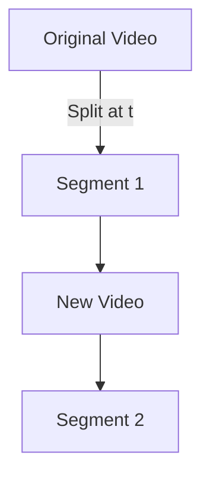

# How to Cut a Video and Insert Another in Between in CineTune

## Overview

CineTune’s video editor is built around a timeline-based interface, where each video (or media) is represented as an item on the timeline. The timeline supports splitting (cutting) video items and adding new videos at any position, allowing you to insert a new video between two segments of an existing video.

---

## Step-by-Step Process

### 1. **Splitting (Cutting) a Video**

- **Select the Video Item:**  
  Click on the video item in the timeline that you want to split.

- **Move the Playhead:**  
  Drag the playhead (the vertical line indicating the current time) to the exact position where you want to cut the video.

- **Split Action:**  
  - Use the “Split” button (often represented by a scissors or split icon) in the timeline header.
  - This triggers the `doActiveSplit` function, which dispatches the `ACTIVE_SPLIT` action with the current time as the split point.

- **What Happens Internally:**  
  - The timeline logic (handled by the `@designcombo/timeline` package and custom timeline classes) splits the selected video item into two separate items at the playhead position.
  - The original video is now represented as two timeline items:  
    - The first from the start to the split point  
    - The second from the split point to the end

#### **Programmatic Split Example**

```ts
import { dispatch } from "@designcombo/events";
import { ACTIVE_SPLIT } from "@designcombo/state";

// Example: split at 5000ms (5 seconds)
dispatch(ACTIVE_SPLIT, {
  payload: {}, // usually empty
  options: {
    time: 5000, // split time in ms
  },
});
```

---

### 2. **Inserting a New Video Between the Split Segments**

- **Add New Video:**  
  - Use the upload or add video functionality to bring a new video into your project.
  - Drag the new video from the uploads panel onto the timeline, placing it between the two split segments.

- **Timeline Structure:**  
  - The timeline now contains three video items in sequence:  
    1. The first segment of the original video  
    2. The newly inserted video  
    3. The second segment of the original video

- **Adjust as Needed:**  
  - You can drag, trim, or further split any of these items to fine-tune the sequence.

#### **Programmatic Insert Example**

```ts
import { dispatch } from "@designcombo/events";
import { ADD_VIDEO } from "@designcombo/state";
import { generateId } from "@designcombo/timeline";

dispatch(ADD_VIDEO, {
  payload: {
    id: generateId(),
    details: {
      src: "https://your-cdn.com/new-video.mp4", // your new video URL
    },
    metadata: {
      fileName: "new-video.mp4",
      // ...other metadata as needed
    },
  },
  options: {
    resourceId: "main",
    scaleMode: "fit",
    // You may need to specify where to insert (track, position) depending on your timeline logic
  },
});
```

---

## Visual Example



---

## Notes

- If you want to automate the selection of a specific video item, you may need to update the `activeIds` in your store before dispatching `ACTIVE_SPLIT`.
- The actual insertion position of the new video may depend on your timeline’s implementation. If you need to insert at a specific index or track, check your timeline API for such options.
- All actions are non-destructive; you can always move, trim, or remove items from the timeline.

---

**If you want a ready-to-use utility function for this workflow, let the team know your requirements (e.g., select by video ID, insert at a specific time), and a code snippet can be provided!** 